# Organization Domain

## Overview

The organization module manages the location hierarchy and shift patterns for the plant.
It follows Hexagonal (Ports & Adapters) architecture.

---

## Location

Locations form a tree hierarchy with four kinds:

| Kind      | Description                        |
|-----------|------------------------------------|
| `PLANT`   | Root node — no shift pattern       |
| `AREA`    | Area within a plant                |
| `LINE`    | Production line within an area     |
| `SECTION` | Section within a line              |

Each non-PLANT location holds a `shift_pattern_id` that links it to a `ShiftPattern`.

### Location HTTP Routes

| Method | Path                                                            | Description                                           |
|--------|-----------------------------------------------------------------|-------------------------------------------------------|
| POST   | `/v1/api/organization/locations/`                               | Create a root (PLANT) location                        |
| POST   | `/v1/api/organization/locations/add`                            | Add a child location to a tree                        |
| GET    | `/v1/api/organization/locations/`                               | Get all location trees                                |
| GET    | `/v1/api/organization/locations/:location_code`                 | Get a location tree by root code                      |
| POST   | `/v1/api/organization/locations/:location_code/shift-patterns`  | Create a shift pattern and link it to the location    |

---

## Shift Pattern

```mermaid
gantt
    title Shift Pattern
    todayMarker off
    dateFormat HH:mm
    axisFormat %H:%M
    Initial day :vert, v1, 00:00, 1m
    Final day :vert, v1, 23:59, 1m
    section Day offset 0
        Shift 1 :a1, 06:00, 8h
        Shift 2 :a1, 14:00, 8h
        Shift 3 :crit, 22:00, 2h
    section Day offset 1
        Shift 3 (previous day offset):crit, 00:00, 6h
        Shift 1 :a1, 06:00, 8h
        Shift 2 :a1, 14:00, 8h
        Shift 3 :crit, 22:00, 2h
    section Day offset 2
        Shift 3 (previous day offset):crit, 00:00, 6h
        Shift 1 :a1, 06:00, 8h
        Shift 2 :a1, 14:00, 8h
        Shift 3 :crit, 22:00, 2h
    section Day offset 3
        Shift 3 (previous day offset):crit, 00:00, 6h
        Shift 1 :a1, 06:00, 8h
        Shift 2 :a1, 14:00, 8h
        Shift 3 :crit, 22:00, 2h
    section Day offset 4
        Shift 3 (previous day offset):crit, 00:00, 6h
        Shift 1 :a1, 06:00, 8h
        Shift 2 :a1, 14:00, 8h
        Shift 3 :crit, 22:00, 2h
    section Day offset 5
        Shift 3 (previous day offset):crit, 00:00, 6h
        Shift 1 :a1, 06:00, 8h
        Shift 2 :a1, 14:00, 8h
        Shift 3 :crit, 22:00, 2h
    section Day offset 6
        Shift 3 (previous day offset):crit, 00:00, 6h
        Shift 1 :a1, 06:00, 8h
        Shift 2 :a1, 14:00, 8h
    section Day offset 7
        Shift 1 :a1, 06:00, 8h
        Shift 2 :a1, 14:00, 8h
```



A `ShiftPattern` is a rotating sequence of `ShiftEntry` items anchored to a reference date.
`cycle_length` is explicit — it defines how many days are in one full rotation (e.g. 3 = tri-daily, 7 = weekly).
Each day in the cycle is identified by a 0-based `day_index`. Multiple entries can share the same `day_index`,
representing concurrent shifts on that day (e.g. Shift 1, Shift 2, Shift 3 all on day 0).
Days with no entries are implicitly off — there is no need to declare off days.

Shift patterns are always created in the context of a location (`POST .../locations/:location_code/shift-patterns`).
The pattern is persisted and the location's `shift_pattern_id` is updated atomically in the same request.

### ShiftPattern structure

```json
{
  "id": "uuid",
  "name": "Weekly",
  "ref_start_date": "2024-01-01",
  "cycle_length": 7,
  "entries": [
    { "day_index": 0, "name": "Shift 1", "start_time": "06:00", "end_time": "14:00" },
    { "day_index": 0, "name": "Shift 2", "start_time": "14:00", "end_time": "22:00" },
    { "day_index": 0, "name": "Shift 3", "start_time": "22:00", "end_time": "06:00" },
    { "day_index": 5, "name": "Shift 1", "start_time": "06:00", "end_time": "14:00" },
    { "day_index": 5, "name": "Shift 2", "start_time": "14:00", "end_time": "22:00" }
  ],
  "created_at": "2024-01-01T00:00:00Z"
}
```

**Notes:**
- `cycle_length` is required and must be >= 1. Each `day_index` must be in `[0, cycle_length)`.
- Multiple entries with the same `day_index` represent concurrent shifts on that day.
- Days with no entries are implicitly off — do not declare them.
- `start_time` / `end_time` use `"HH:MM"` format (24-hour).
- Overnight shifts (where `end_time < start_time`) automatically wrap to the next calendar day.
- `ref_start_date` uses `"YYYY-MM-DD"` format and anchors the rotation cycle.

### ShiftPattern HTTP Routes

| Method | Path                                                            | Description                                           |
|--------|-----------------------------------------------------------------|-------------------------------------------------------|
| POST   | `/v1/api/organization/locations/:location_code/shift-patterns`  | Create a shift pattern and link it to the location    |
| GET    | `/v1/api/organization/shift-patterns/:id`                       | Get a shift pattern by UUID                           |
| PUT    | `/v1/api/organization/shift-patterns/:id`                       | Update a shift pattern name and entries               |
| DELETE | `/v1/api/organization/shift-patterns/:id`                       | Delete a shift pattern                                |

### Create — Request Body

```json
{
  "name": "Weekly 3-Shift",
  "ref_start_date": "2024-01-01",
  "cycle_length": 7,
  "entries": [
    { "day_index": 0, "name": "Shift 1", "start_time": "06:00", "end_time": "14:00" },
    { "day_index": 0, "name": "Shift 2", "start_time": "14:00", "end_time": "22:00" },
    { "day_index": 0, "name": "Shift 3", "start_time": "22:00", "end_time": "06:00" },
    { "day_index": 1, "name": "Shift 1", "start_time": "06:00", "end_time": "14:00" },
    { "day_index": 1, "name": "Shift 2", "start_time": "14:00", "end_time": "22:00" },
    { "day_index": 1, "name": "Shift 3", "start_time": "22:00", "end_time": "06:00" },
    { "day_index": 5, "name": "Shift 1", "start_time": "06:00", "end_time": "14:00" },
    { "day_index": 5, "name": "Shift 2", "start_time": "14:00", "end_time": "22:00" },
    { "day_index": 6, "name": "Shift 1", "start_time": "06:00", "end_time": "14:00" },
    { "day_index": 6, "name": "Shift 2", "start_time": "14:00", "end_time": "22:00" }
  ]
}
```

Days 2–4 have no entries, so they are implicitly off.

### Update — Request Body

```json
{
  "name": "Weekly 2-Shift",
  "cycle_length": 7,
  "entries": [
    { "day_index": 0, "name": "Shift 1", "start_time": "07:00", "end_time": "15:00" },
    { "day_index": 0, "name": "Shift 2", "start_time": "15:00", "end_time": "23:00" }
  ]
}
```
